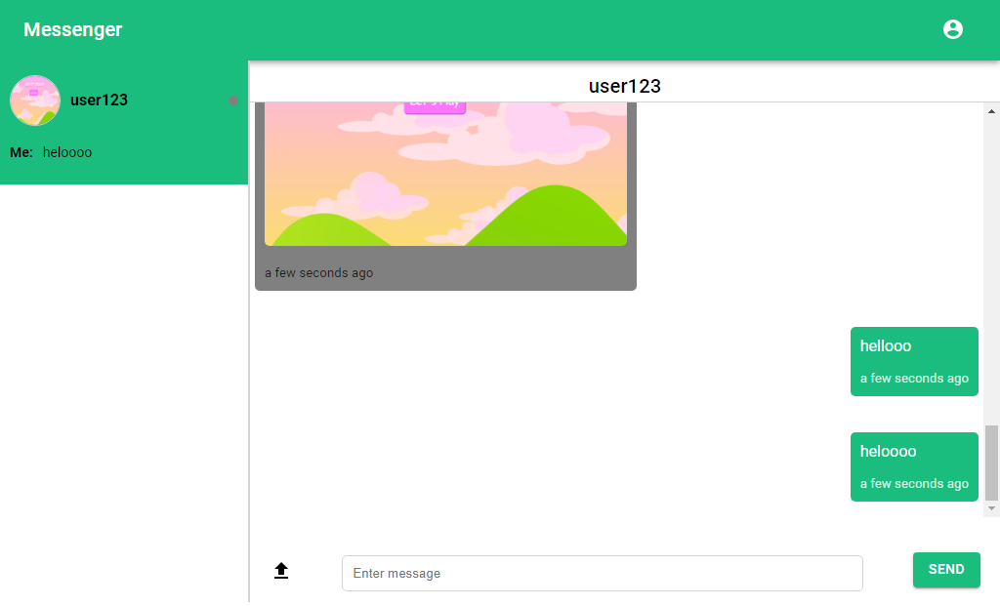

# CHAT APP

# TECH USED
1. React Js
2. Firebase v9 (Database, Authentication, Storage)
3. MUI
4. React Router v6

# FEATURES
1. Sending and Receiving Text Messages
2. Sending Images
3. Authentication
4. Profile image and user name update
5. New message and unread messages notification
